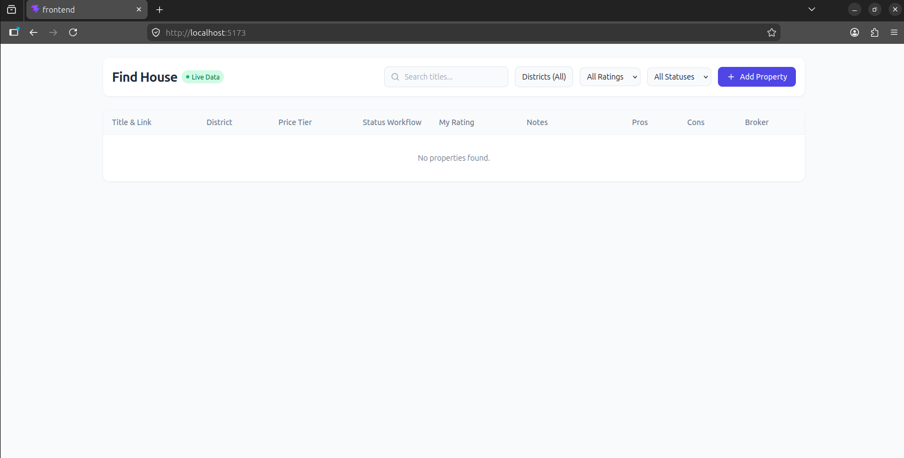
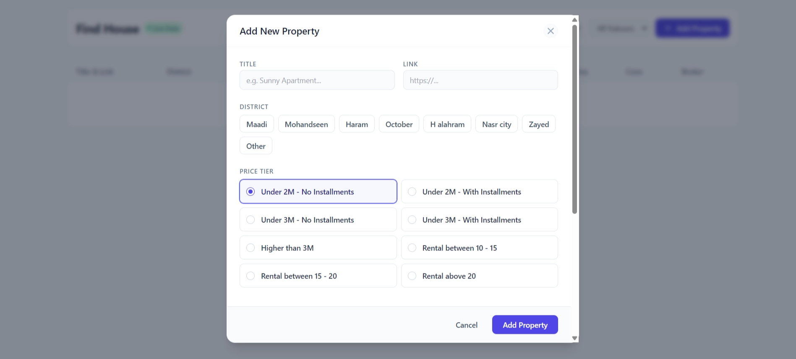
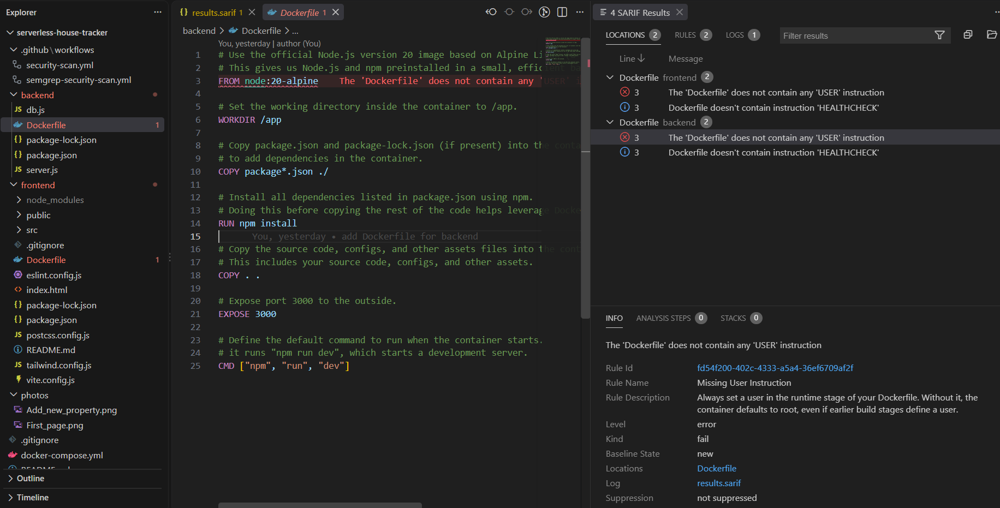

# 🏡 serverless-house-tracker

A modern, serverless, full-stack real-estate tracking and evaluation platform built for organizing, evaluating, and managing house-hunting workflows and broker contacts.
Eliminate spreadsheet friction while house hunting. Track listing URLs, price tiers, district-specific pros/cons, and broker reliability in a fast, low-friction dashboard built on React, Node.js, and AWS Serverless.

---

## 📐 Table of Contents

- [Overview](#-overview)
- [Application Screenshots](#-application-screenshots)
- [Tech Stack](#-tech-stack)
- [Repository Structure](#-repository-structure)
- [Data Models & Schema](#-data-models--schema)
- [API Documentation](#-api-documentation)
- [Local Development Setup](#-local-development-setup)
- [CI/CD Pipelines (GitHub Actions)](#-cicd-pipelines-github-actions)


---

## 🌟 Overview

The **Find House** application simplifies house hunting by providing an interactive interface to track target properties, organize evaluation stages, log ratings and notes, list pros & cons, and manage real estate broker contacts.

### Key Features
- **Workflow Pipeline Tabs**: Move properties across stages: `INBOX`, `VERIFIED`, `VISITED`, `DECISION`.
- **Flexible Pricing Tiers**: Filter by budget categories including purchase options (e.g. Under 2M/3M with or without installments, Higher than 3M) and rental tiers (`10k-15k`, `15k-20k`, `Above 20k`).
- **Rating System**: 1 to 5 star rating (`my_rating`) for personal property evaluation.
- **Broker Management**: Maintain broker details and track broker reliability ratings (`GOOD`, `AVERAGE`, `BAD`).
- **Advanced Filtering & Search**: Instant real-time search by title, district, status, rating, or price tier.

---

## 📸 Application Screenshots

### 1. Main Dashboard (Start Page)
The main interface when opening the frontend application, displaying the property workflow pipeline, category filters, ratings, and property list:



---

### 2. Add New Property Modal
The interactive modal opened when clicking the **"Add Property"** button to record property details, set price tier, select broker, list pros & cons, and set rating:



---

### 3. Reading Security SARIF Reports in VS Code
The security scanning workflows (KICS & Semgrep SAST) export standardized `.sarif` report files. Using the official **SARIF Viewer** extension in VS Code, you can open and inspect security findings, line-by-line code locations, vulnerability severity levels, and remediation steps directly inside your editor:



#### 💡 How to View SARIF Reports Locally:
1. Install the **SARIF Viewer** extension in VS Code (`ms-sarifvscode.sarif-viewer`).
2. Download the artifact (`results.sarif` or `semgrep.sarif`) from your GitHub Actions run.
3. Open the `.sarif` file in VS Code (`File > Open File`). The SARIF Explorer panel will automatically render, highlighting all findings directly on your source code lines!


---

## 🛠 Tech Stack

| Layer | Technology |
| :--- | :--- |
| **Frontend UI** | React 18, Vite, Tailwind CSS, Lucide Icons |
| **Backend API** | Node.js (v20), Express.js, `@aws-sdk/client-dynamodb`, `@aws-sdk/lib-dynamodb` |
| **Database** | AWS DynamoDB (On-Demand PAY_PER_REQUEST pricing) |
| **Local Containerization**| Docker & Docker Compose |
| **CI/CD** | GitHub Actions with workflows |

---

## 📁 Repository Structure

```
.
├── .github/
│   └── workflows/
│       ├── security-scan.yml          # Automated security scanning (Trivy & KICS)
│       └── semgrep-security-scan.yml  # Static application security testing (Semgrep SAST)
|
├── backend/
│   ├── Dockerfile                 # Docker container setup for Express API
│   ├── db.js                      # AWS SDK v3 DynamoDB Document Client initialization
│   ├── server.js                  # Express API routes, validation & business logic
│   └── package.json               # Backend dependencies
│
├── frontend/
│   ├── src/
│   │   ├── App.jsx                # Main application component & interactive state
│   │   ├── App.css                # Custom styling utilities
│   │   └── main.jsx               # React entry point
│   ├── Dockerfile                 # Docker container setup for React Vite app
│   ├── vite.config.js             # Vite development server settings
│   ├── tailwind.config.js         # Tailwind styling setup
│   └── package.json               # Frontend dependencies
│
├── photos/
│   ├── First_page.png             # Application main page screenshot
│   ├── Add_new_property.png       # Add new property modal screenshot
│   └── SARIF.png                      # SARIF Viewer VS Code extension screenshot
│
├── docker-compose.yml             # Local multi-container development environment
│
└── README.md                      # Project documentation
```

---

## 📊 Data Models & Schema

### 1. `Houses` Table (Partition Key: `property_id` [String])

| Field | Type | Options / Description |
| :--- | :--- | :--- |
| `property_id` | String (UUID) | Primary Key |
| `title` | String | Property display name |
| `link` | String | Listing URL (e.g. Property Finder, OLX) |
| `status` | String (Enum) | `INBOX`, `VERIFIED`, `VISITED`, `DECISION` |
| `price_tier` | String (Enum) | `UNDER_2M_NO_INSTALLMENTS`, `UNDER_2M_WITH_INSTALLMENTS`, `UNDER_3M_NO_INSTALLMENTS`, `UNDER_3M_WITH_INSTALLMENTS`, `HIGHER_3M`, `RENTAL_10_15`, `RENTAL_15_20`, `RENTAL_ABOVE_20` |
| `district` | String | Location / Area |
| `broker_id` | String | Linked broker ID |
| `pros` | Array of Strings| Key advantages |
| `cons` | Array of Strings| Drawbacks |
| `notes` | String | Custom notes |
| `my_rating` | Integer | Rating score (1 to 5) |

### 2. `Brokers` Table (Partition Key: `broker_id` [String])

| Field | Type | Options / Description |
| :--- | :--- | :--- |
| `broker_id` | String | Primary Key (Phone number or UUID) |
| `name` | String | Broker name |
| `phone` | String | Contact phone number |
| `reliability` | String (Enum) | `GOOD`, `AVERAGE`, `BAD` |

---

## 🔌 API Documentation

### Houses Endpoints

- **`GET /api/houses`**
  - **Description**: Fetches all recorded house properties.
  - **Response**: `200 OK` with JSON array of houses.

- **`POST /api/houses`**
  - **Description**: Creates a new house entry.
  - **Body Payload**:
    ```json
    {
      "title": "Modern Apartment in New Cairo",
      "link": "https://example.com/property/123",
      "status": "VERIFIED",
      "price_tier": "UNDER_3M_WITH_INSTALLMENTS",
      "district": "New Cairo",
      "broker_id": "01000000000",
      "pros": ["Garden view", "Underground parking"],
      "cons": ["High maintenance fees"],
      "notes": "Spoke to owner, price negotiable.",
      "my_rating": 4
    }
    ```

- **`PUT /api/houses/:id`**
  - **Description**: Updates specific fields for a property by `property_id`.

### Brokers Endpoints

- **`GET /api/brokers`**
  - **Description**: Fetches all registered real estate brokers.

- **`POST /api/brokers`**
  - **Description**: Registers or updates a broker record.

---

## 💻 Local Development Setup

You can run the entire environment locally using **Docker Compose** without configuring AWS.

### Prerequisites
- [Docker Desktop](https://www.docker.com/products/docker-desktop/) installed and running.
- Node.js v20+ (optional, if running without Docker).

### Step-by-Step Execution

1. **Clone the repository**:
   ```bash
   git clone [serverless-house-tracker](https://github.com/mahmoud20H/serverless-house-tracker.git)
   cd "serverless-house-tracker"
   ```

2. **Launch with Docker Compose**:
   ```bash
   docker-compose up --build
   ```

3. **Access Services**:
   - **Frontend App**: `http://localhost:5173`
   - **Backend API**: `http://localhost:3000`
   - **DynamoDB Local**: `http://localhost:8000`

> 💡 *Note*: The `dynamodb-init` container automatically runs upon startup to initialize the `Houses` and `Brokers` tables in DynamoDB Local.

---


## 🚀 CI/CD Pipelines (GitHub Actions)

The repository contains automated GitHub Actions workflows located under `.github/workflows/`:

| Pipeline | Trigger | Description |
| :--- | :--- | :--- |
| **`security-scan.yml`** | `workflow_dispatch` (Manual) | Parallel security analysis using **Trivy** (app/dependencies) and **KICS** (Terraform/Dockerfiles SARIF output). |
| **`semgrep-security-scan.yml`** | `workflow_dispatch` (Manual) | Static Application Security Testing (**Semgrep SAST**) for code & configuration analysis, generating `semgrep.sarif`. |

### Automated Security Scanning Highlights
- **Trivy Job**: Scans filesystem dependencies across `./backend` and `./frontend` for High & Critical vulnerabilities. Fails the build if critical issues are detected.
- **KICS Job**: Analyzes Docker files (`backend/Dockerfile`, `frontend/Dockerfile`) for security misconfigurations, exporting results as a SARIF artifact.
- **Semgrep SAST Job**: Performs static security code analysis to catch code vulnerabilities (such as prototype pollution, object injection, or insecure settings), exporting results as a SARIF artifact.

---